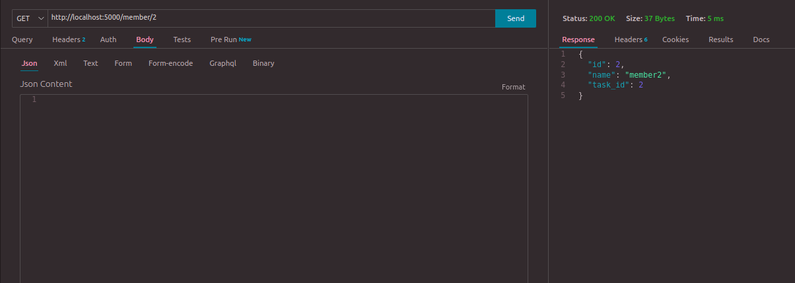
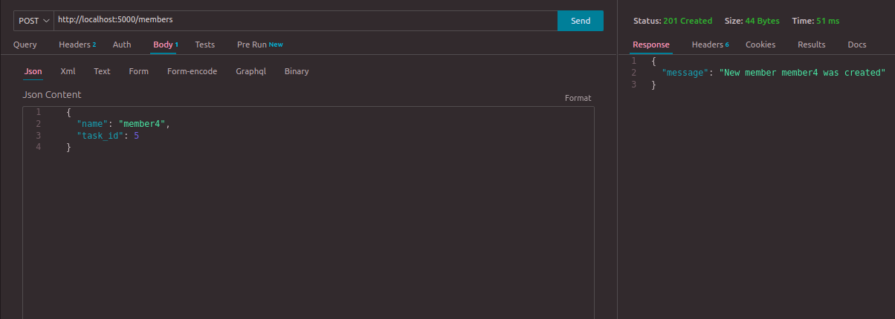
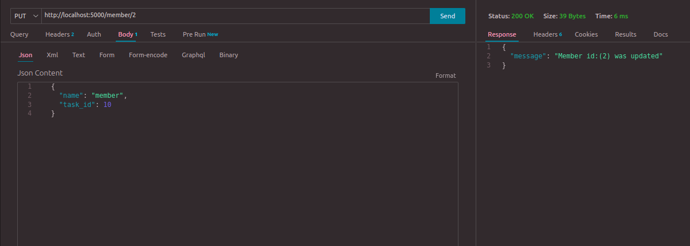
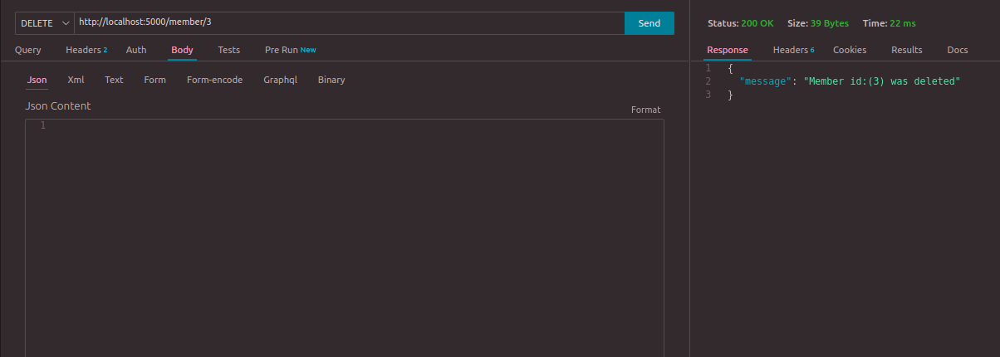
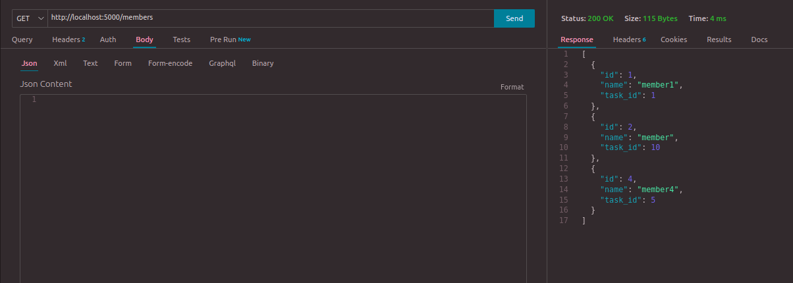

# Тестування працездатності системи

## Отримання всієї таблиці member

## Отримання окремого члена таблиці member

## Створення нового члена таблиці member

## Редагування члена таблиці member

## Видалеання члена таблиці member

## Фінальний результат

